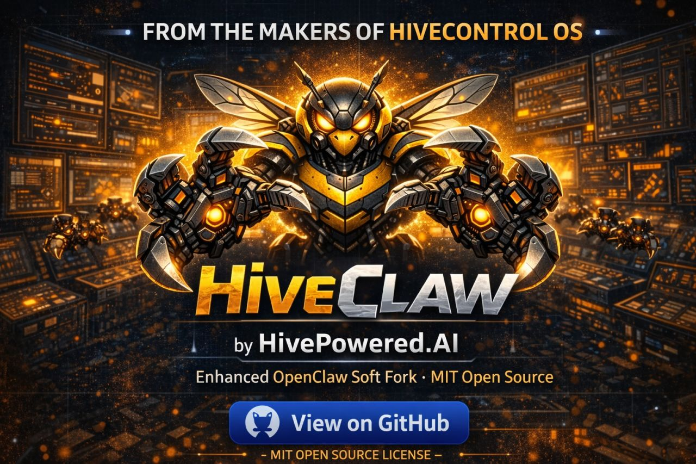

<p align="center">
  
</p>

<h1 align="center">HiveClaw</h1>

<p align="center">
  <strong>Your AI Agent Swarm Command Center</strong><br>
  Enhanced OpenClaw soft fork with HiveControl OS dashboard, HiveWorkflow engine, and persistent memory.
</p>

<p align="center">
  <a href="#quick-start">Quick Start</a> &middot;
  <a href="#features">Features</a> &middot;
  <a href="#architecture">Architecture</a> &middot;
  <a href="#hivecontrol-os">Dashboard</a> &middot;
  <a href="#hivemem">Memory</a> &middot;
  <a href="#docker">Docker</a> &middot;
  <a href="#agents">Agents</a> &middot;
  <a href="docs/CONTRIBUTING.md">Contributing</a>
</p>

<p align="center">
  
  
  
  
</p>

---

## What is HiveClaw?

**HiveClaw** is a fully integrated AI agent platform that combines the power of [OpenClaw](https://github.com/openclaw/openclaw) with a mission-control dashboard, workflow engine, and persistent memory system. Install it on any machine (Linux, macOS, or Windows) and immediately start deploying agent swarms to solve real problems.

Think of it this way: **OpenClaw is the engine. HiveClaw is the cockpit.**

Built by [HivePowered.AI](https://hivepowered.ai) under the MIT license.

---

## Features

**Agent Swarm Management** — 8 specialist agents organized under the Orion orchestrator. Spawn, monitor, and coordinate agents from a single dashboard or CLI.

**HiveControl OS Dashboard** — 9 real-time screens: Dashboard, Tasks, Calendar, Memory, Projects, Documents, Team, Office, and Workflow. Pure HTML/CSS/JS — zero build step, opens in any browser.

**HiveMem Persistent Memory** — Built-in SQLite memory that survives restarts. Agents share knowledge across sessions. Inspired by [mem9](https://github.com/mem9-ai/mem9), upgraded to TiDB when you're ready to scale.

**HiveWorkflow Engine** — Natural language workflow builder. Describe what you want, Orion decomposes it into agent tasks, spawns the right specialists, and tracks execution.

**Governor Mode** — API budget protection with 3-tier exponential backoff. Prevents runaway costs from rate-limit storms.

**Cross-Platform** — Runs on Linux, macOS, and Windows. Native install scripts for each, plus Docker for one-command deployment.

**OpenClaw Compatible** — Soft fork that stays in sync with upstream OpenClaw. All 20+ messaging channels (WhatsApp, Telegram, Slack, Discord, Signal, Teams, etc.) work out of the box.

---

## Quick Start

### Option 1: Native Install

```bash
# Clone
git clone https://github.com/inspireyourbrand-dev/hiveclaw.git
cd hiveclaw

# Linux / macOS
bash scripts/install.sh

# Windows (PowerShell)
powershell -ExecutionPolicy Bypass -File scripts\install.ps1

# Start
hiveclaw start
```

### Option 2: Docker

```bash
git clone https://github.com/inspireyourbrand-dev/hiveclaw.git
cd hiveclaw
cp .env.example .env
docker compose up -d
```

### Option 3: Manual

```bash
git clone https://github.com/inspireyourbrand-dev/hiveclaw.git
cd hiveclaw
npm install
cp .env.example .env
node gateway/index.js
```

Then open the dashboard: **http://localhost:18789/__hiveclaw__/hivecontrol/**

---

## Architecture

```
┌─────────────────────────────────────────────────────────┐
│                    HiveClaw Gateway                      │
│                  (Express + WebSocket)                    │
│                                                          │
│  ┌──────────────┐  ┌──────────────┐  ┌───────────────┐  │
│  │ HiveControl  │  │  HiveMem     │  │ HiveWorkflow  │  │
│  │ OS Dashboard │  │  Memory API  │  │    Engine      │  │
│  │ (9 screens)  │  │ (SQLite/TiDB)│  │ (orchestrate) │  │
│  └──────────────┘  └──────────────┘  └───────────────┘  │
│                                                          │
│  ┌──────────────┐  ┌──────────────┐  ┌───────────────┐  │
│  │  Governor     │  │  Auth        │  │  Agent Bus    │  │
│  │  Mode         │  │  Middleware   │  │  (WebSocket)  │  │
│  └──────────────┘  └──────────────┘  └───────────────┘  │
└──────────────────────────┬──────────────────────────────┘
                           │
              ┌────────────┼────────────┐
              │            │            │
         ┌────┴────┐ ┌────┴────┐ ┌────┴────┐
         │ OpenClaw │ │  CLI    │ │ Docker  │
         │ Runtime  │ │ Client  │ │ Deploy  │
         └─────────┘ └─────────┘ └─────────┘
```

### Component Overview

| Component | Purpose | Location |
|-----------|---------|----------|
| **Gateway** | HTTP + WebSocket server, routes everything | `gateway/` |
| **HiveControl OS** | Web dashboard with 9 management screens | `hivecontrol/` |
| **HiveMem** | Persistent agent memory (SQLite built-in) | `hivemem/` |
| **HiveWorkflow** | Natural language workflow decomposition | `hiveworkflow/` |
| **Governor** | API budget protection & rate limiting | `gateway/middleware/governor.js` |
| **Agents** | 8 specialist agents + Orion orchestrator | `agents/` |
| **CLI** | Command-line management tool | `cli/` |
| **Plugins** | OpenClaw runtime integration | `gateway/plugins/` |
| **Playbooks** | Operational runbooks | `playbooks/` |
| **Skills** | Agent capability definitions | `skills/` |

---

## HiveControl OS

The dashboard serves at `/__hiveclaw__/hivecontrol/` and provides 9 live screens:

| Screen | Purpose |
|--------|---------|
| **Dashboard** | System overview — agent status, active swarms, resource usage |
| **Tasks** | Task queue management and assignment |
| **Calendar** | Scheduled workflows and cron jobs |
| **Memory** | Browse and search HiveMem persistent storage |
| **Projects** | Multi-agent project tracking |
| **Documents** | Documentation and knowledge base |
| **Team** | Agent swarm roster and health |
| **Office** | Communication hub and message routing |
| **Workflow** | Visual workflow builder and execution monitor |

All screens are pure HTML/CSS/JS with the HivePowered dark theme. No build step required — they're served directly by the gateway.

---

## HiveMem

Persistent, shared memory for your agent swarm. Inspired by [mem9](https://github.com/mem9-ai/mem9).

**Default mode**: Built-in SQLite database. Zero config, zero external dependencies. Memories persist across restarts and are shared between all agents.

**Scale mode**: Switch to TiDB Cloud for cloud-persistent, multi-tenant memory with vector search. Just update `.env`.

### API

```bash
# Store a memory
curl -X POST http://localhost:18789/api/v1/hivemem/memories \
  -H "Content-Type: application/json" \
  -d '{"content": "The deploy uses blue-green strategy", "tags": ["devops"]}'

# Search memories
curl http://localhost:18789/api/v1/hivemem/memories?q=deploy&limit=5

# CLI
hiveclaw memory search "deploy strategy"
hiveclaw memory stats
```

### Agent Tools

All agents have access to: `memory_store`, `memory_search`, `memory_get`, `memory_update`, `memory_delete`

[Full HiveMem documentation](hivemem/README.md)

---

## Agents

HiveClaw ships with 8 specialist agents organized under the Orion orchestrator:

```
ORION (Sentinel & Entry Point)
├── ATLAS   — Code Analyzer & Architecture Scholar
├── FORGE   — Builder & Infrastructure Master
└── PATCH   — Systems Healer & Repair Specialist
    ├── QUILL  — Documentation Scribe & Knowledge Keeper
    ├── CIPHER — Security Guardian & Access Keeper
    └── PIXEL  — UI/UX Artist & Design Master
        └── SPARK — Performance Igniter & Optimization Engine
```

Each agent has defined scope boundaries, escalation triggers, and output contracts. See [agents/AGENTS.md](agents/AGENTS.md) for the complete specification.

---

## CLI

```bash
hiveclaw setup              # First-time setup wizard
hiveclaw start              # Start the gateway
hiveclaw start --dev        # Start in verbose mode
hiveclaw status             # System health check
hiveclaw doctor             # Full diagnostics
hiveclaw agents             # List agent swarm
hiveclaw memory search <q>  # Search memories
hiveclaw memory stats       # Memory statistics
hiveclaw version            # Version info
```

---

## Docker

One-command deployment:

```bash
cp .env.example .env        # Configure
docker compose up -d        # Deploy
docker compose logs -f      # Watch logs
```

The Docker image uses Node 22 Alpine with a multi-stage build for minimal size. Memory persists in a named Docker volume.

---

## API Reference

| Endpoint | Method | Description |
|----------|--------|-------------|
| `/health` | GET | System health and component status |
| `/api/v1/agents` | GET | List all agents and active swarms |
| `/api/v1/agents/spawn` | POST | Spawn a new agent task |
| `/api/v1/hivemem/memories` | GET | Search memories |
| `/api/v1/hivemem/memories` | POST | Store a memory |
| `/api/v1/hivemem/memories/:id` | GET/PUT/DELETE | CRUD operations |
| `/api/v1/hivemem/stats` | GET | Memory statistics |
| `/api/v1/workflows` | GET/POST | Workflow management |
| `/api/v1/workflows/:id/run` | POST | Execute a workflow |
| `/api/v1/governor` | GET | Governor mode status |
| `/ws` | WebSocket | Real-time agent bus |

---

## Configuration

Copy `.env.example` to `.env` and configure:

```bash
# Gateway
OPENCLAW_GATEWAY_PORT=18789

# Memory
HIVEMEM_ENABLED=true
HIVEMEM_STORAGE=sqlite          # or 'tidb' for cloud

# Workflow
HIVEWORKFLOW_ENABLED=true

# Governor (API budget protection)
GOVERNOR_ENABLED=true
GOVERNOR_MAX_CONCURRENT=1
GOVERNOR_MIN_DELAY_MS=2000
```

See [.env.example](.env.example) for all options.

---

## Project Structure

```
hiveclaw/
├── agents/           # Agent specifications (8 agents + hierarchy)
├── bin/              # CLI entry point
├── branding/         # HivePowered theme and assets
├── cli/              # CLI commands (setup, start, status, memory)
├── docs/             # Architecture, contributing, security guides
├── gateway/          # Express + WebSocket server
│   ├── middleware/    # Auth, Governor, Memory middleware
│   └── plugins/      # OpenClaw runtime plugins
├── hivecontrol/      # Dashboard (9 HTML screens)
│   ├── lib/          # Client-side JS (bus, websocket)
│   └── screens/      # Individual screen pages
├── hivemem/          # Persistent memory system
├── hiveworkflow/     # Workflow decomposition engine
├── playbooks/        # Operational runbooks
├── scripts/          # Install scripts (Linux, macOS, Windows)
├── skills/           # Agent skill definitions
├── tasks/            # Task tracking
├── Dockerfile        # Docker build
├── docker-compose.yml
├── package.json
└── .env.example      # Configuration template
```

---

## Credits

HiveClaw is built on the shoulders of giants:

- **[OpenClaw](https://github.com/openclaw/openclaw)** — The open-source AI gateway that powers the agent runtime
- **[mem9](https://github.com/mem9-ai/mem9)** — Inspiration for the HiveMem persistent memory architecture
- **[HiveControl OS](https://github.com/inspireyourbrand-dev/hivecontrol-os)** — The original dashboard project

---

## License

MIT License. See [LICENSE](LICENSE) for details.

---

<p align="center">
  Built with purpose by <a href="https://hivepowered.ai">HivePowered.AI</a><br>
  Making AI accessible, manageable, and useful for everyone.
</p>
